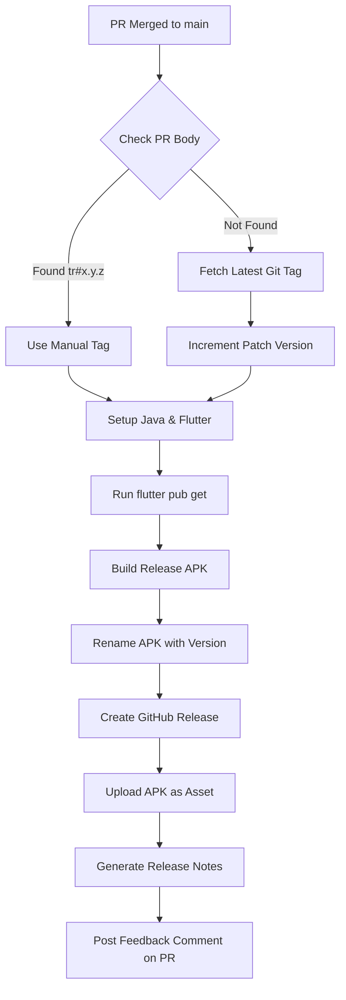

# CI/CD & Release Documentation

Swift Ride uses GitHub Actions to automate the build and release process. The pipeline is designed to generate a signed Android APK and create a GitHub Release whenever code is merged into the `main` branch.

---

## 🛠 Automation Workflow: `post_merge.yaml`

The release process is defined in [post_merge.yaml](.github/workflows/post_merge.yaml).

### 1. Triggering a Release
The workflow triggers automatically when a Pull Request is **closed and merged** into the `main` branch.

### 2. Versioning Strategy
The pipeline uses a semi-automated versioning logic:
1.  **PR Labeling**: The script first scans the Pull Request description for a special tag: `tr#x.y.z` (e.g., `tr#1.2.0`).
2.  **Auto-Increment**: If no tag is found in the PR body, the system:
    - Fetches the latest release tag from Git.
    - Increments the **patch** version (e.g., `1.0.4` becomes `1.0.5`).
    - Uses `1.0.0` as the baseline if no tags exist.

### 3. Build & Artifacts
- **Environment**: Ubuntu Latest with Java 17 and the stable Flutter channel.
- **Commands**: `flutter build apk --release`
- **Renaming**: The generic `app-release.apk` is renamed to `swift_ride_<version>.apk` to reflect the current release version.

### 4. PR Integration
- **Feedback**: Once the release is successfully built and uploaded, the system automatically posts a comment on the Pull Request with a link to the new Release and cleanup instructions.

---

## 📈 Pipeline Visualization

The following diagram illustrates the automated path from code merge to user download.

---

## 📦 Maintenance
To modify the release process:
- **Build Settings**: Update the `Build Release APK` step in the YAML for flavor changes or app bundles (AAB).
- **Permissions**: Ensure the GitHub Token has `contents: write` permissions to create releases.
- **Java/Flutter Versions**: Managed via the `setup-java` and `flutter-action` steps.
