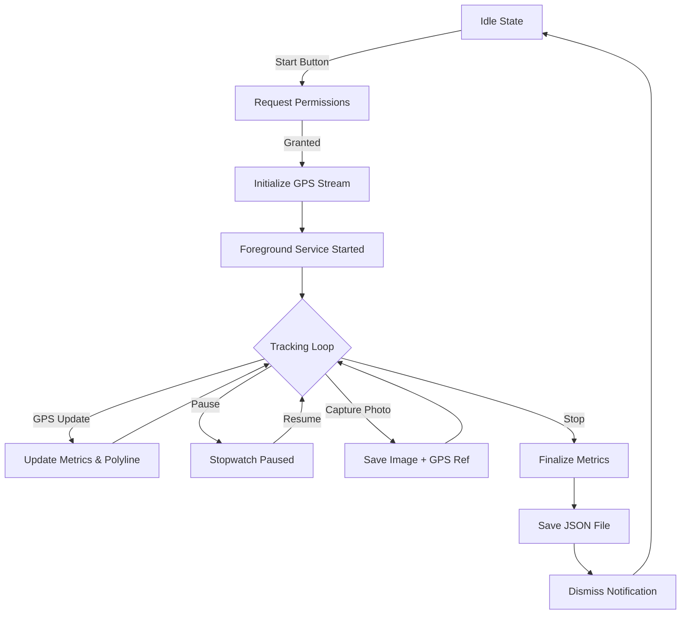
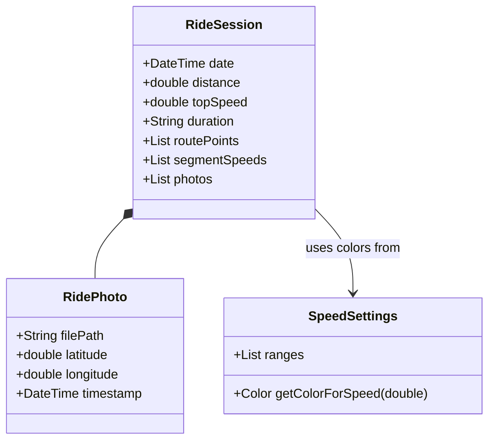

# Swift Ride Features & Documentation

Swift Ride is a specialized motorcycle ride tracker designed to provide real-time performance metrics and detailed route logging with a focus on visual speed analytics.

---

## 🚀 Core Features

### 1. GPS Dashboard (Live View)
The primary interface provides high-visibility stats essential for riders:
- **Distance**: Real-time odometer showing the current ride's length in Kilometers.
- **Time**: Elapsed time since the start of the ride.
- **Top Speed**: peak speed achieved during the current session.
- **Interactive Control**: Large, glove-friendly Start/Stop and Pause/Resume buttons.

### 2. Live Map & Speed Heatmap
The tracking map uses OpenStreetMap data to render your path dynamically.
- **Dynamic Polyline**: Your route is drawn in real-time.
- **Speed Color Coding**: The route changes color based on your speed, providing an instant visual "heatmap" of your ride.
- **Photo Markers**: Photos taken during the ride are pinned to their exact GPS coordinates on the map.

### 3. Ride Logs & Archiving
Every completed ride is saved locally for future review.
- **Ride Details**: View full maps, speed stats, and photos from past rides.
- **Exporting**: Export ride data as JSON or standard **GPX** files for use in other mapping software.
- **Archiving**: Group multiple rides into named "Archives" to keep your history organized.

### 4. Custom Speed Settings
Tailor the speed heatmap to your riding style.
- **Define Thresholds**: Set specific speed ranges (e.g., City, Highway, Performance).
- **Custom Colors**: Assign distinct colors to each range via a built-in color picker.

---

## 🛠 Technical Logic

### Ride Tracking Lifecycle
The following flowchart illustrates how the app manages a tracking session, including foreground services and notifications.

### Data Architecture
Swift Ride uses a flat-file JSON structure for maximum portability and simplicity.

---

## 📱 Notifications & Quick Actions
- **Foreground Service**: Ensures tracking continues even when the app is in the background or the screen is off.
- **Interactive Notification**: Control your ride (Pause/Stop) directly from the Android notification shade.
- **Quick Actions**: Long-press the app icon to "Start Ride" immediately without navigating the UI.
